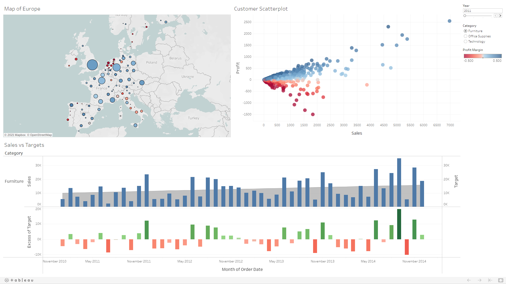

# Amazing Mart (EU) Sales Analysis
**Access the full, interactive dashboard on Tableau Public using this link:**
https://public.tableau.com/views/AmazingMartEUSalesAnalysisDashboard/SalesAnalysisDashboard?:language=en-US&publish=yes&:display_count=n&:origin=viz_share_link

## Background
- Amazing Mart (EU) is a mega-retailer of furniture, office supplies and technology devices
- The company operates and delivers products in numerous cities all across Europe

## Objectives
- Visualise the sales performance (number of sale transactions and profit margin) across the different states
- Identify the individual customers with the highest profit margin to create possible loyalty programs in the future
- Compare sales performance (total sales) against sales targets across the different product categories over the years (2011-2015)

## Data
- 1 Excel workbook containing 3 sheets:
    - `ListOfOrders`
        - Order ID
        - Order Date
        - Customer Name
        - City 
        - Country
        - Region
        - Segment
        - Ship Date
        - Ship Mode
        - State
    - `OrderBreakdown`
        - Order ID
        - Product Date
        - Discount
        - Sales
        - Profit
        - Quantity
        - Category
        - Sub-Category
    - `SalesTargets`
        - Month of Order Date
        - Category
        - Target
- `ListOfOrders` and `OrderBreakdown` are combined using an inner join on the `Order ID` column

## Key features
1. Map of Europe
    - Assign a hierarchy for geographic fields to enable drilling up and down of data at the country, state or city level
    - Generate map of Europe for the main visualization; use state as the level of granularity
    - Use size of circles to indicate the number of sales; use relative sizes to compare the number of sales across different states
    - Create a calculated field for profit margin using total `Profit` divided by total `Sales`
    - Use colour palette to reflect the profit margin; red indicates negative profit margin, blue indicates positive profit margin
    - Insert and show year as a filter to further aggregate at the level of granularity of year; apply this filter to the customer scatterplot as well and allow users to choose the year they want to see
2. Customer Scatterplot
    - Create a scatterplot of profit versus sales for each customer, further aggregated to the level of granularity of state; this is done because customers purchase items from different states in different countries
    - Apply the same colour palette as the map to reflect the profit margin; red indicates negative profit margin, blue indicates positive profit margin
3. Sales vs Targets
    - Split by category and show total sales for each month of the time period as a bar chart
    - Use a blend to bring in data from the sales targets
        - A blend is preferred over a join because the `SalesTargets` data set is at a different level of granularity from the `ListOfOrders`+`OrderBreakdown`
        - Using a join in this situation will result in the loss of information
        - Blend data from `SalesTargets` on the `Category` and `Month of Order Date` columns
    - Show `Target` for each month as an area chart and combine with the total sales chart as a dual axis chart; synchronise the axes
    - Create a calculated field within a blend to calculate excess of target, i.e. `Sales`-`Target`, and plot it for each month as a separate bar chart
        - Use a red-green colour palette to reflect a negative/ positive outcome; red reflects that sales targets were not met, green reflects that sales targets were met
    - Use category as a filter to take away clutter and reduce the size of the visual; show the filter to allow users to choose which category (`Furniture`, `Office Supplies` or `Technology`) they want to see
4. Dashboard
    - Add in a dashboard action to highlight the relevant customers on the customer scatterplot whenever a state on the map is selected
    
## Analysis and insights
- The company is not doing well in Sweden, Portugal, Ireland and the Netherlands; we are posting negative profit margins for operations in all states in these countries every year
- At the same time, many of the individual customers with negative profit margins are coming from states in these countries
- Need to relook different aspects of operations in these countries such as pricing model and delivery; can also look at what we have done in the states/countries that we are performing well in
- The `Furniture`, `Office Supplies` and `Technology` departments have 3 distinct ways of setting sales targets:
    - `Furniture` department increases its sales target every month
    - `Office Supplies` department reviews its sales targets every quarter; sales targets may increase or decrease depending of the sales trend
    - `Technology` department increases its sales targets every year
- The `Office Supplies` department's method of reviewing sales targets every quarter does seem to be the most effective in terms of hitting the sales targets. It has the fewest number of months where targets were not met and the quartely review enables targets to be set based on seasonal trends in consumer spending