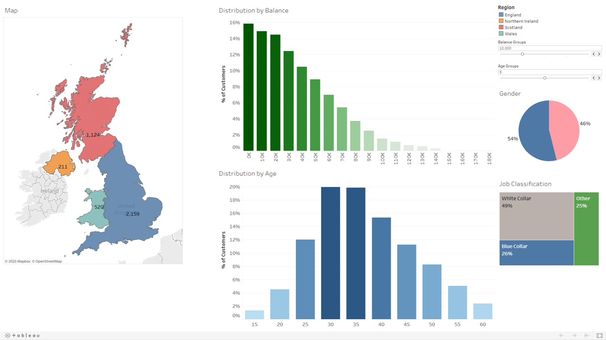

# Customer Segmentation Dashboard
**Access the full, interactive dashboard at Tableau Public using this link:**
https://public.tableau.com/views/Section6_16316397522840/SegmentationDash?:language=en-US&publish=yes&:display_count=n&:origin=viz_share_link

## Data
- **Dummy data** for an imaginary bank operating in the UK (England, Scotland, Wales, N. Ireland)
- Contains bank customer information:
    - Customer ID
    - Name
    - Surname
    - Gender
    - Age
    - Religion
    - Job classification
    - Date joined
    - Balance
    
## Objective
- Create a customer segmentation dashboard to understand customer demographics
- Visualise gender, professions, age groups and account balance
- Analyse how different regions are represented in the customer base; what is the demographic of the customer base in each region?
- Use insights to create business and serve customers better
- Craft a storyline to tell executives/decision-makers

## Key features
1. Map of the UK
    - Original dataset does not have any dimensions that are recognised by Tableau as a geographic field
    - Set the region column in the dataset as a geographic field
    - Show the number of customers in each region
2. Pie chart to see gender split
    - Use table calculations to show the number of males/females as a percentage instead of the actual count
3. Histograms to show the distributions of age and account balance
    - Break ages and balance into bins
    - Use table calculations to show the number of customers in each bin as a percentage of the total number of customers
    - Use parameters to dynamically adjust the visualisation; e.g. quickly change the size of the bins
4. Tree map to show job classifications
5. Advanced dashboard interactivity
    - Use each worksheet in the dashboard as a filter; every other visualisation in the dashboard will adjust accordingly once a selection has been made
    - Remove the automatic pop-up that follows the cursor

## Analysis and insights
### Overall
- **Number of customers (descending order):**
    - England
    - Scotland
    - Wales
    - N. Ireland
- **Balance**
    - Distribution drops off quite gradually at first before having steeper drop-offs
    - This behaviour is expected since more customers are expected to have their balance in the lower bands
    - Roughly 45% of customers have a balance of less than 30,000 dollars
- **Age**
    - About 40% of customers are in their 30s
    - Slightly right skewed distribution
- **Gender**
    - Not much of a difference in the number of male (54%) and female customers (45%)
- **Job classfication**
    - Nearly half of all customers are white collar workers
    - 25% each for blue collar workers and others

### By region/country (compared to the overall)
- **England**
    - Not much change in the distribution of balance and gender
    - Distribution of customers becomes more normal instead of right skewed; implies that lesser older customers are found in england
    - 70% of customers from England are working as white collar workers; much more than the 40% overall
    - Might have something to do with London being an economic hub; maybe more white collar workers choose to bank with us
    - Adjust the marketing for England to suit the 70% of white collar workers; create products and services specific to their needs
- **Scotland** 
    - Not much change in the distribution of balance
    - Gender breakdown changes significantly; 72% male vs 28% female
    - Very few white collar workers (8%); mostly blue collar workers and others (92% combined)
    - Age demographic is very different; more than 40% of customers are in their late 40s and early 50s
    - 53% of workers in the "Others" category are female, 47% are male; roughly 50-50 split; keep in consideration the female representation in this segment
- **Wales**
    - Distribution of balance does not drop of so quickly; large representation of mid-size balances from 0 to 45,000 dollars which is not consistent with the overall baseline
    - Distribution of characteristics such as age, gender and job classification are quite consistent with the overall trends
- **N. Ireland**
     - Slight anomaly in the balance distribution; high proportion of low-amount balances (consider small sample size of just 211 customers)
     - Age demographic is slightly younger with customers mostly in their late 20s to early 30s; compare to the overall, where most customers are in their early/late 30s
     - Age demographic might also explain the balance distribution; younger people are more likely to have smaller account balances
     - Predominantly female (74%) demographic
     - 50% of the Scotland demographic works in the "Others" job classification, of which 89% are female
     
## Use cases
- Market products differently depending on the customer demographics of the region
- Sell tailored products that are more relevant to customers
- Deliver better customer experience by showing an understanding of the customers and what they are likely to care about