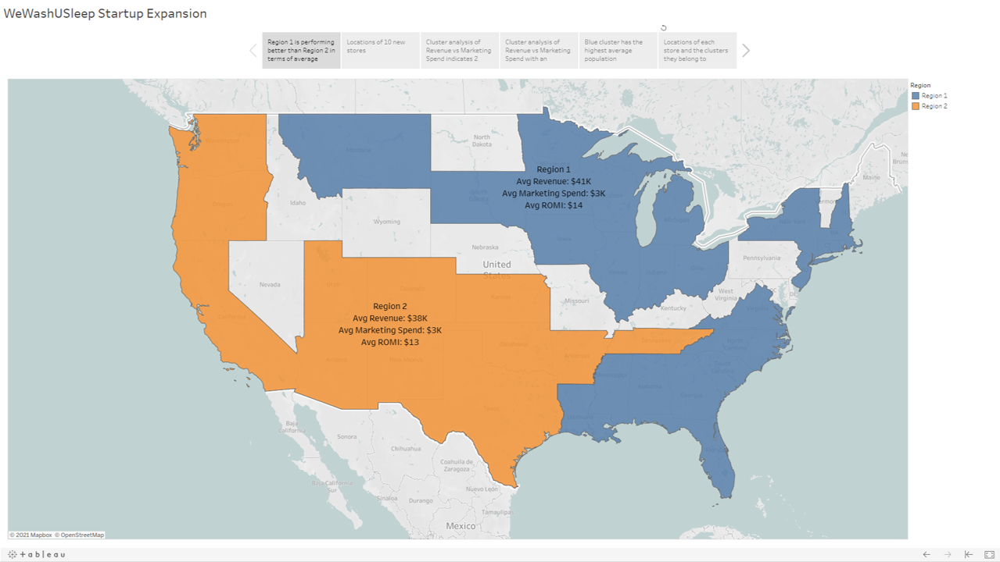

# WeWashUSleep Startup Expansion
**Access the full, interactive storyline on Tableau Public using this link:** https://public.tableau.com/views/WeWashUSleepStartupExpansion/WeWashUSleepStartupExpansion?:language=en-US&publish=yes&:display_count=n&:origin=viz_share_link

## Background
- Laundry pickup services startup WeWashUSleep is a relatively small company and cannot compete with the big players in major
cities
- The company's strategy is to build a vast network in the smaller cities
- WeWashUSleep already has a strong presence in 140 locations and recently opened stores in 10 new cities
- Additionally, the company has 2 separate sales regions

## Objectives
### 2 analytics tasks
1. Identify which of the 2 sales regions is performing better; i.e. outperforms the other in 2 of the following 3 metrics:
    - Average revenue 
    - Average marketing spend (less is better)
    - Average Return On Marketing Investment (ROMI); i.e. revenue/marketing spend
2. Identify which of the 10 new stores have the best potential for the company to invest more funds into marketing 

## Data
### P1-StartupExpansion.xlsx
Contains information on the 150 stores of WeWashUSleep:
- Store ID
- City
- State
- Sales Region (Region 1 or 2)
- New Expansion (new or old store; recently opened 10 stores in new cities)
- Marketing spend
- Revenue

### P1-US-Cities-Population.csv
Contains information on the top 304 US cities by population:
- 2015 Rank
- City
- State
- 2015 Estimate
- 2010 Census
- Change
- 2014 Land Area
- 2010 Population Density
- Location

## Key Features
1. Map showing sales regions 1 and 2
    - Create custom geographical regions using groups to calculate metrics for the entire region
2. Map showing all the stores in different states and cities
    - Visualise revenue by color and size of markers
    - Add "New Expansion" into the level of detail and use as a highlighter for a non-intrusive way to differentiate between old and new stores; non-intrusive i.e. not using up other visualisation features like colour or shape etc.
3. Scatterplot of Revenue versus Marketing Spend
    - At the level of detail of Store ID
    - Expect that revenue should increase as marketing spend increases
    - Can visually see 2 distinct clusters of stores:
        - Revenue of orange cluster seems to be stuck around 20,000 dollars regardless of marketing spend
        - Revenue of blue cluster generally increases as marketing spend increases
    - Use Tableau's Cluster Model to analytically identify clusters; Tableau uses K-Means clustering in the background
    - Add "New Expansion" into the level of detail and use as a highlighter to differentiate between old and new stores
4. Cross database join (Excel and CSV)
    - Laundry pickup service is a business that is dependent on the population; i.e. more people => more dirty clothes
    - Need to factor in the city's population into the analysis
    - Lower cluster from the K-Means clustering model could be cities with small populations; there is a limit to how much marketing in these cities can attract customers; no matter how much more you spend on marketing in a city with a small population, revenue will not increase
    - Use Tableau's ability to join data from different sources, such as the store database (Excel) and the population database (CSV)
    - Join on multiple fields (both city and state) because there are duplicate cities in the US, i.e. same city name in different states
5. Scatterplot of Revenue versus Marketing Spend with trendlines after considering the effect of population
    - When population is considered, 3 clusters instead of 2 are created by the K-Means clustering algorithm; clusters are shown by the colours
    - Clusters confirm the suspicion that population affects revenue
    - Red cluster are cities with small populations; revenue does not increase as marketing spend increases due to a limit in the number of customers; every 1 dollar spent on marketing returns 0.94 dollars which is actually loss making
    - Orange cluster are cities with medium sized populations; every 1 dollar spent on marketing increases revenue by 7.32 times
    - Blue cluster are cities with the largest populations; every 1 dollar spent on marketing increases revenue by 3.17 times
    - Dont show recalculated trendline for highlighted or selected data points
6. Bar chart to compare cluster populations (save clusters as a group)
7. Map to show which clusters each city belongs to (save clusters as a group)
    - Revenue is indicated by size of markers
    
## Analysis and insights
- Of the new stores, the store in the red cluster (Store ID 149) is not a good choice to invest in marketing because the city population is low, which limits customer attraction
- The 5 stores in the blue cluster (Store IDs 141, 142, 144, 145, 147) seem like obvious choices because of their high revenue and the large populations of the cities in which they reside, but the trend line indicates an increase in revenue of 3.17 dollars per dollar spent on marketing 
- Compared to the orange cluster, where the trend line indicates an increase in revenue of 7.32 dollars per dollar spent on marketing => much more potential for the company to invest in marketing for the 4 new stores in the orange cluster (Store IDs 143, 148, 146, 150) 